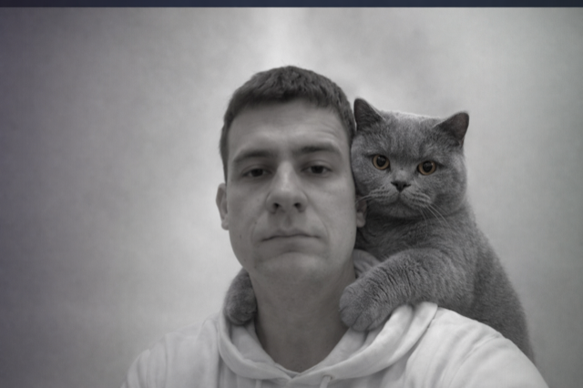

# Александр Мамонтов

**Full Stack Web / CMS / PWA разработчик**
Сайты, CMS‑проекты, PWA, API‑интеграции, Telegram‑боты, поддержка и деплой.

[Email](mailto:mamont861@yandex.ru) · [Telegram](https://t.me/mamont861) · [GitHub](https://github.com/Aleksandr861) · [Resume PDF](resume/Aleksandr-FullStack-Resume.pdf)

---

## Профиль

Разрабатываю web‑проекты под реальный запуск: от структуры и интерфейса до CMS, backend‑логики, интеграций, публикации и поддержки.

Работаю с коммерческими сайтами, образовательными проектами, PWA‑приложениями, Telegram‑ботами и небольшими backend‑сервисами. Flutter/Dart использую как дополнительный стек для PWA и mobile‑ориентированных интерфейсов.

---

## Стек

**Frontend:** JavaScript, TypeScript, React, HTML5, CSS3, Vite, Webpack
**Backend / API:** PHP, REST API, FastAPI, Python, webhooks, Telegram Bot API
**CMS:** OpenSquare, Nubex, контентные страницы, формы, SEO‑структура
**PWA / Mobile:** Flutter, Dart, PWA, WASM, Firebase, Provider, go_router
**Data / Infra:** Supabase, PostgreSQL, Docker, Nginx, GitHub Actions, GitHub Pages, Vercel, TimeWeb

---

## Работы

| Проект | Задача | Стек | Ссылка |
|---|---|---|---|
| **2HEARTS** | Сайт знакомств и PWA‑приложение: профили, мэтчинг, чат, медиа, push, backend‑сервисы | Flutter, Dart, PWA, WASM, Supabase, Firebase, FastAPI, Docker, Nginx | [2-hearts.ru](https://2-hearts.ru) |
| **Ozon5min Bot** | Telegram‑бот под прикладной пользовательский сценарий | PHP, Telegram Bot API, webhook, automation | [t.me/ozon5min_bot](https://t.me/ozon5min_bot) |
| **Sharvkube.ru** | Корпоративный сайт услуг с документами, формами, Telegram‑уведомлениями и SEO‑базой | HTML, CSS, JavaScript, PHP, Telegram, GitHub Actions, TimeWeb | [sharvkube.ru](https://sharvkube.ru) |
| **Лицей «Интеллект»** | Сайт образовательной организации: структура разделов, новости, документы, контакты, доступность | Nubex, CMS, HTML/CSS, jQuery, SEO | [intellect-balashikha.ru](https://intellect-balashikha.ru) |
| **Grand Tours** | Англоязычный корпоративный сайт travel‑компании | OpenSquare, CMS, B2B, контентная структура | [grandtoursdmc.com](https://www.grandtoursdmc.com/) |
| **React CRUD** | SPA‑демо с CRUD‑сценариями и работой с API | React, TypeScript, REST | [Demo](https://aleksandr861.github.io/React_lifecycle-crud-frontend/) · [Code](https://github.com/Aleksandr861/React_lifecycle-crud-frontend) |
| **Booking Tickets** | Интерфейс бронирования билетов | TypeScript, CSS, Vite | [Demo](https://aleksandr861.github.io/FE_diploma/) · [Code](https://github.com/Aleksandr861/FE_diploma) |

---

## Что делаю

- сайты компаний, лендинги, контентные и CMS‑проекты;
- PWA и Flutter Web‑приложения;
- SPA и интерфейсы на React / TypeScript;
- REST API, webhooks, Telegram‑боты и интеграции;
- формы, карты, документы, уведомления, аналитика;
- SEO‑база, скорость, деплой, поддержка и доработки.

---

## Формат работы

1. Уточняю цель, ограничения и критерии готовности.
2. Фиксирую объём, сроки и стоимость до старта.
3. Разбиваю работу на этапы и показываю прогресс.
4. Тестирую, публикую, передаю исходники и инструкции.

**Форматы:** фикс / почасово / по этапам.

---

## Контакты

- Email: [mamont861@yandex.ru](mailto:mamont861@yandex.ru)
- Telegram: [@mamont861](https://t.me/mamont861)
- GitHub: [github.com/Aleksandr861](https://github.com/Aleksandr861)
